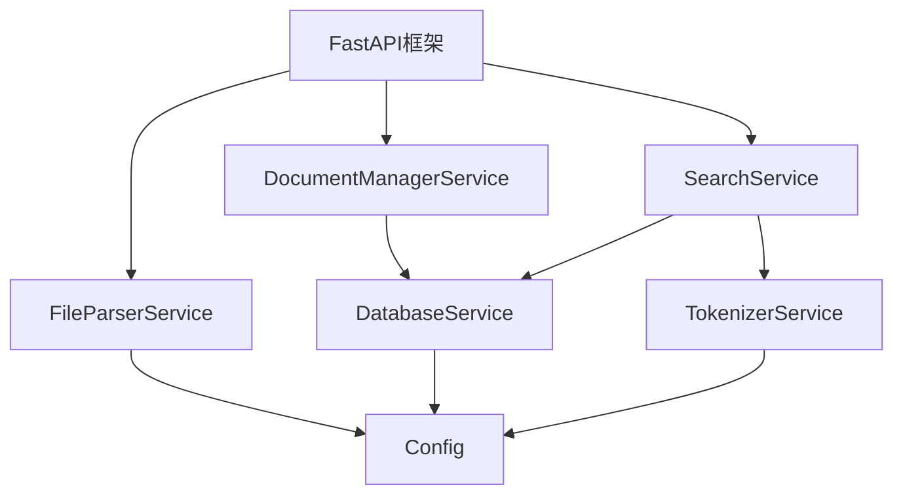

# 后端组件化架构文档

## 1. 架构概述

本项目采用组件化架构，实现了业务逻辑与框架层的完全分离，遵循"业务逻辑不依赖框架，框架只负责调度"的核心原则。

### 1.1 架构层次

- **框架层**：FastAPI框架，负责HTTP请求接收、路由分发和响应处理
- **业务逻辑层**：核心业务组件，实现具体的业务功能
- **数据模型层**：定义数据结构和接口契约
- **依赖注入层**：管理组件间的依赖关系
- **配置管理层**：处理配置加载和管理

## 2. 核心组件

### 2.1 分词处理服务 (TokenizerService)

**职责**：
- 实现中文文本分词
- 支持搜索查询分词
- 检测文本是否为中文

**接口**：
- `tokenize(text: str) -> List[str]`：对文本进行分词
- `tokenize_search_query(query: str) -> str`：对搜索查询进行分词处理
- `is_chinese(text: str) -> bool`：检测文本是否为中文

**使用示例**：
```python
from core.services import container

# 获取分词服务
tokenizer_service = container.resolve('tokenizer_service')

# 分词处理
text = "这是一个测试文本"
tokens = tokenizer_service.tokenize(text)
print(tokens)  # 输出：['这是', '一个', '测试', '文本']

# 搜索查询分词
query = "测试搜索"
tokenized_query = tokenizer_service.tokenize_search_query(query)
print(tokenized_query)  # 输出："测试 搜索"
```

### 2.2 文件解析服务 (FileParserService)

**职责**：
- 解析Excel文件
- 解析Word文件
- 解析文本文件

**接口**：
- `parse_file(file_path: str, file_type: str) -> FileParseResult`：解析文件内容
- `parse_excel(file_path: str) -> FileParseResult`：解析Excel文件
- `parse_word(file_path: str) -> FileParseResult`：解析Word文件
- `parse_text(file_path: str) -> FileParseResult`：解析文本文件

**使用示例**：
```python
from core.services import container

# 获取文件解析服务
file_parser_service = container.resolve('file_parser_service')

# 解析文本文件
result = file_parser_service.parse_file('test.txt', 'txt')
print(result.content)  # 输出文件内容
print(result.success)  # 输出是否解析成功
```

### 2.3 数据库服务 (DatabaseService)

**职责**：
- 初始化数据库连接
- 管理数据库会话
- 提供数据库操作接口

**接口**：
- `get_db() -> Session`：获取数据库会话
- `init_db()`：初始化数据库
- `close_db(db: Session)`：关闭数据库会话

**使用示例**：
```python
from core.services import container

# 获取数据库服务
database_service = container.resolve('database_service')

# 获取数据库会话
db = database_service.get_db()
try:
    # 执行数据库操作
    pass
finally:
    database_service.close_db(db)
```

### 2.4 文档管理服务 (DocumentManagerService)

**职责**：
- 创建文档
- 查询文档
- 更新文档
- 删除文档
- 列出文档

**接口**：
- `create_document(db: Session, filename: str, file_type: str, content: str) -> Tuple[Document, str]`：创建文档
- `get_document(db: Session, document_id: int) -> Document`：获取文档
- `update_document(db: Session, document_id: int, content: str) -> Tuple[Document, str]`：更新文档
- `delete_document(db: Session, document_id: int) -> str`：删除文档
- `list_documents(db: Session, skip: int = 0, limit: int = 100) -> List[Document]`：列出文档

**使用示例**：
```python
from core.services import container
from database import SessionLocal

# 获取文档管理服务
document_manager_service = container.resolve('document_manager_service')

# 创建数据库会话
db = SessionLocal()

# 创建文档
doc, message = document_manager_service.create_document(db, 'test.txt', 'txt', '测试内容')
print(f"创建文档: {message}")

# 列出文档
documents = document_manager_service.list_documents(db)
print(f"文档数量: {len(documents)}")

db.close()
```

### 2.5 搜索服务 (SearchService)

**职责**：
- 执行全文搜索
- 支持分页
- 提供搜索结果计数

**接口**：
- `search(db: Session, query: str, page: int = 1, page_size: int = 10) -> SearchResult`：执行搜索
- `get_search_count(db: Session, query: str) -> int`：获取搜索结果数量

**使用示例**：
```python
from core.services import container
from database import SessionLocal

# 获取搜索服务
search_service = container.resolve('search_service')

# 创建数据库会话
db = SessionLocal()

# 执行搜索
result = search_service.search(db, '测试')
print(f"搜索结果数量: {result.total}")
for item in result.results:
    print(f"文件名: {item.filename}, 匹配度: {item.score}")

db.close()
```

## 3. 依赖注入系统

### 3.1 依赖注入容器 (Container)

**职责**：
- 管理服务实例
- 处理服务间的依赖关系
- 支持依赖注入

**接口**：
- `register(name: str, factory: Callable)`：注册服务
- `resolve(name: str) -> Any`：解析服务实例

**使用示例**：
```python
from core.services import container

# 获取服务实例
tokenizer_service = container.resolve('tokenizer_service')
file_parser_service = container.resolve('file_parser_service')
search_service = container.resolve('search_service')
```

## 4. 配置管理系统

### 4.1 配置管理 (Config)

**职责**：
- 加载配置
- 管理配置项
- 支持环境变量和配置文件

**接口**：
- `get(key: str, default: Any = None) -> Any`：获取配置项
- `set(key: str, value: Any)`：设置配置项

**使用示例**：
```python
from core.utils.config import Config

# 创建配置实例
config = Config()

# 获取配置项
db_url = config.get('DATABASE_URL', 'sqlite:///./data/unstructured_data.db')
upload_dir = config.get('UPLOAD_DIR', './uploads')
```

## 5. 框架层

### 5.1 FastAPI路由

**职责**：
- 处理HTTP请求
- 分发路由
- 响应处理
- 参数验证

**主要路由**：
- `GET /`：健康检查
- `POST /upload`：文件上传
- `GET /documents`：获取文档列表
- `GET /search`：搜索文档
- `GET /health`：健康检查
- `GET /db-check`：数据库连接检查

**使用示例**：
```bash
# 启动服务
uvicorn main:app --reload

# 文件上传
curl -X POST http://localhost:8000/upload -F "file=@test.txt"

# 搜索
curl http://localhost:8000/search?query=测试

# 获取文档列表
curl http://localhost:8000/documents
```

## 6. 组件间依赖关系



## 7. 测试策略

### 7.1 单元测试

- 每个服务都有对应的单元测试
- 测试覆盖核心功能
- 测试独立于框架

### 7.2 集成测试

- 测试组件间的协作
- 测试API接口
- 测试文件上传和搜索功能

## 8. 部署与运行

### 8.1 安装依赖

```bash
pip install -r requirements.txt
```

### 8.2 启动服务

```bash
# 开发模式
uvicorn main:app --reload

# 生产模式
uvicorn main:app --host 0.0.0.0 --port 8000
```

### 8.3 环境变量

- `DATABASE_URL`：数据库连接URL
- `UPLOAD_DIR`：文件上传目录
- `MAX_UPLOAD_SIZE`：最大上传文件大小

## 9. 代码结构

```
backend/
├── core/
│   ├── models/           # 数据模型
│   ├── services/         # 业务服务
│   └── utils/            # 工具类
├── data/                # 数据文件
├── tests/               # 测试文件
├── uploads/             # 上传文件
├── main.py             # FastAPI应用
├── database.py         # 数据库配置
└── requirements.txt    # 依赖文件
```

## 10. 最佳实践

1. **依赖注入**：使用依赖注入容器获取服务，避免硬编码依赖
2. **接口设计**：定义清晰的接口契约，确保组件间松耦合
3. **测试驱动**：为每个组件编写单元测试，确保代码质量
4. **配置管理**：使用配置管理系统，避免硬编码配置
5. **错误处理**：统一错误处理，提供清晰的错误信息
6. **代码规范**：遵循PEP 8编码规范，保持代码整洁

## 11. 迁移指南

### 11.1 从旧架构迁移

1. 识别业务逻辑与框架耦合点
2. 定义业务接口和数据模型
3. 实现核心业务组件
4. 重构框架层代码
5. 编写测试验证功能
6. 部署新架构

### 11.2 框架迁移

由于业务逻辑与框架完全分离，迁移到其他框架（如Flask）只需修改框架层代码，业务逻辑无需修改。

## 12. 总结

本项目通过组件化和解耦改造，实现了以下目标：

- 业务逻辑与框架完全分离
- 建立了清晰的依赖注入机制
- 设计了统一的接口规范
- 实现了核心功能的组件化
- 提高了代码可维护性和可测试性
- 保证了系统功能的一致性

组件化架构使得系统更加灵活、可扩展，为未来的功能迭代和技术升级奠定了基础。